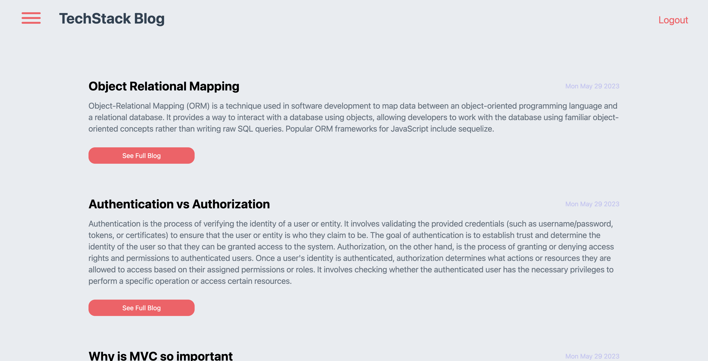

# tech-blog
## Description
Tech blog is a blogging website that allows users to users to create an account, login and post their own blogs to the platform and comment on other blog posts.

- Users can create an accounts, login and logout.
- Users can post their own blog to the platform and comment on any blog post whilst signed in.
- Users can view all of their blog posts in the dashboard page. 
- Users can edit and delete their existing blog posts via the dashboard page.
## Table of contents
- [Installation](#installation)
- [Usage](#Usage)
- [Contributing](#Contributing)
- [Tests](#Tests)
- [Questions](#Questions)
- [license](#license)

## Installation
- View the GitHub repo
1. Clone the repository via `git clone <ssh>`
2. Install all dependencies via `npm install`
3. Seed your MySQL db
3. Start the application via `npm start`

### seed the MySQL db
1. open and sign into mysql cli
2. edit .env file
3. Run schema.sql file in mysql cli
4. Run `npm run seed` in server.js integrated terminal.
## Usage
- The tech blog can be used to view, post and comment on blogs relating to Fullstack web development topics.

### Screenshot

## Built with

### Programming Languages
- HTML
- CSS
- JavaScript
### Frameworks
- Express.js

### Libraries / Packages
- bcryptjs
- connect-session-sequelize
- dotenv
- express
- express-handlebars
- express-session
- handlebars
- mysql2
- nodemon
- sequelize
- sqlite3
## Contributing
- Travis Nicholson
## Tests
- N/A
## Questions
### links
- [GitHub Username](https://github.com/Travisnicholson90)
- [Heroku](https://tech-blog-usyd.herokuapp.com)

### Email
- For any further question relating to this project, please contact me via email.
[Travis Nicholson](mailto::nicholson_travis@hotmail.com)

## License
[]
 - (https://opensource.org/licenses/MIT)

